<div align="center">


# Ubuntu Guardian

**A lightweight, Grafana-style monitor, security reviewer and safe maintenance console for an Ubuntu machine that runs [Immich](https://immich.app).**

[](https://github.com/manojbarot1/ubuntu-guardian/actions/workflows/tests.yml)


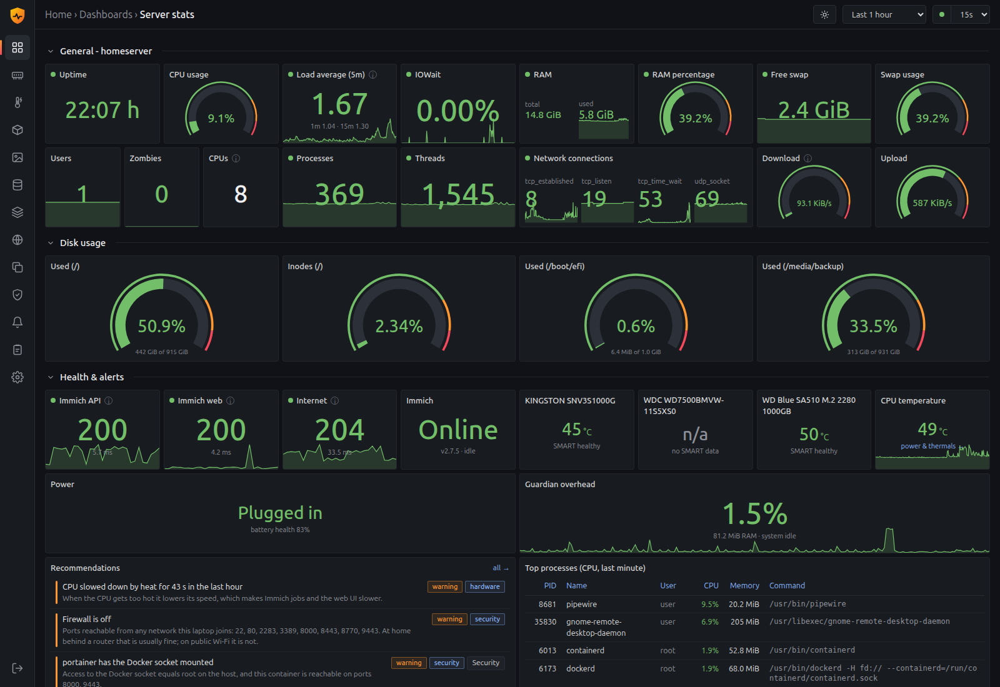

</div>

Guardian is built for the common home setup where an ordinary Ubuntu laptop or desktop doubles as a photo server. It watches CPU, memory, disks, services, Docker and Immich. It reviews the machine's security, including CVE scans of your container images. When you want to change something (stop a service, restart a container, clean up duplicate files), it shows what will happen first, re-checks everything, and records it in an audit log with rollback instructions.

It is designed to **never become the problem it watches for**: about 0.5% of one CPU core and ~60 MB of RAM in normal operation, hard-capped by systemd.

---

## Contents

- [Features](#features)
- [Screenshots](#screenshots)
- [Requirements](#requirements)
- [Install (step by step)](#install-step-by-step)
- [Dashboards](#dashboards)
- [Security review](#security-review)
- [How Guardian stays light](#how-guardian-stays-light)
- [Safety model](#safety-model)
- [Configuration](#configuration)
- [Monitoring a backup job (optional)](#monitoring-a-backup-job-optional)
- [Everyday commands](#everyday-commands)
- [Troubleshooting](#troubleshooting)
- [Uninstall](#uninstall)
- [Development](#development)

---

## Features

| | |
|---|---|
| **Monitoring** | CPU (total and per core, user/system/iowait), load, memory, swap, pressure stall (PSI), disk and network I/O, TCP connection states, processes, threads, zombies, uptime |
| **Memory watch** | Live RAM monitor sampled every second: what's in RAM (apps, cache, free), RAM in/out (pages allocated and freed per second), disk and swap paging, page faults, memory pressure; per-program and per-process memory with 1- and 10-minute change; events when big processes start or exit, jump by hundreds of MB, grow steadily like a leak, or when memory runs low, swap storms or the OOM killer fires |
| **Power & thermals** | Battery charge, health (capacity vs. design), charge cycles, power draw and time left, charge limit; CPU and all sensor temperatures, fan speed, CPU speed and thermal throttling. Suggests an 80% charge limit on an always-plugged-in laptop (commands to copy), warns when running on battery, hot or throttling, or when the fan stops; heavy work pauses on battery or above 90 °C |
| **Docker** | Per-container CPU, memory, page cache, network in/out and disk writes read straight from cgroups (much cheaper than `docker stats`); images, volumes, mounts, compose projects |
| **Immich** | Health, version, busy/idle, library size by folder, Immich's own daily database dumps, protected paths, optional job-queue awareness via API key |
| **Security review** | Patch state, automatic updates, reboot needed, exposed ports and firewall, SSH settings, failed logins, file permissions of secrets, risky containers (privileged, Docker socket), CPU vulnerabilities, kernel hardening, Immich version; a 0–100 score with fixes to copy |
| **Vulnerability scanning** | CVE scan of every running container image with [Trivy](https://trivy.dev), on demand and weekly, CPU- and memory-limited |
| **Storage** | Usage and inode gauges, 30-day history, growth rate and "full in N days", SMART health and temperature (NVMe, SATA and most USB drives, no root needed) |
| **Service intelligence** | What each systemd service is, why it runs, what depends on it, what breaks if you stop or disable it, confidence level |
| **Recommendations** | Deterministic rules with evidence: full disks, failing drives, memory pressure, memory leaks, battery wear and charge limit, running on battery, heat and throttling, exposed ports, crash-looping containers, optional services, security failures |
| **Controlled actions** | Start/stop/restart/enable/disable services, start/stop/restart containers, quarantine duplicate files. Every action needs preview → confirm → re-check → audit |
| **Duplicate finder** | Exact duplicates only (size + SHA-256); protected folders are never scanned; quarantine before delete; restore any time |
| **Dashboard** | Grafana-style dark/light UI with gauges, trend lines, time-range and refresh pickers, collapsible rows, hover tooltips; works on phones |

## Screenshots

| Memory (live) | Power & thermals |
|---|---|
| 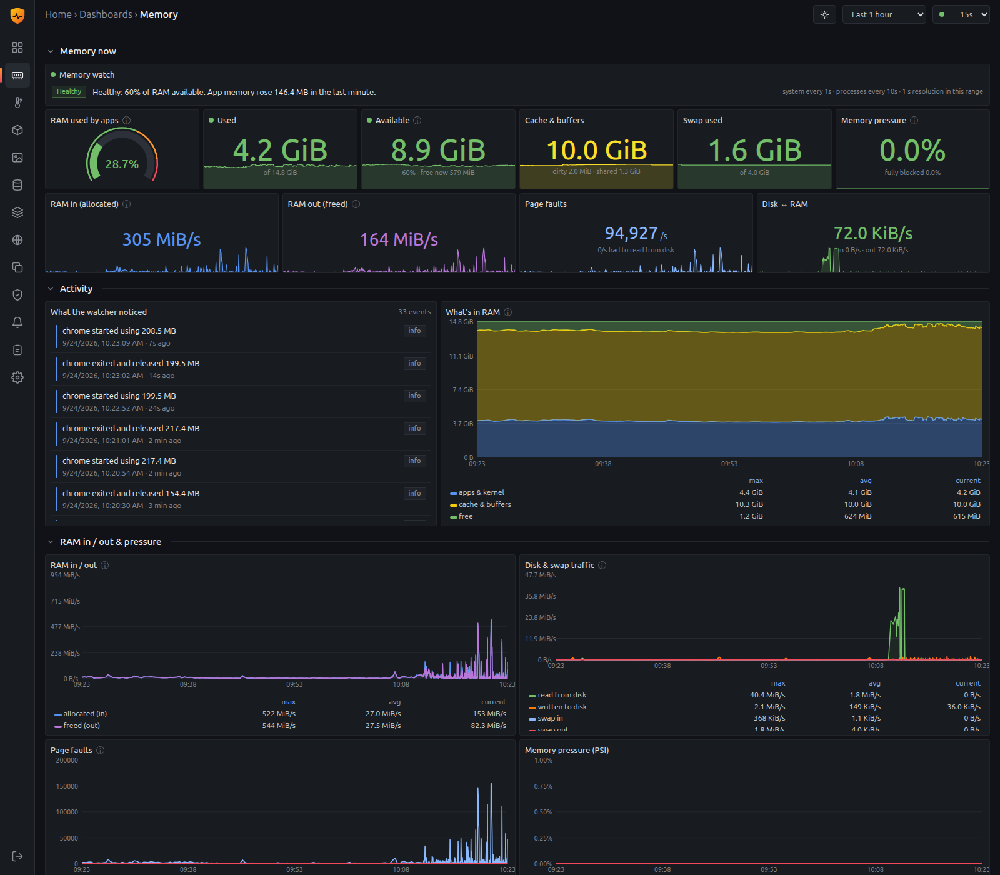 | 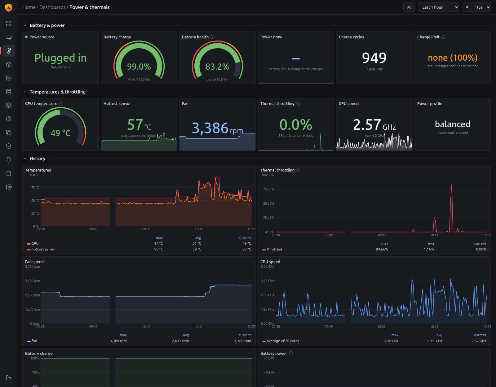 |
| **Security & vulnerabilities** | **Docker containers** |
| 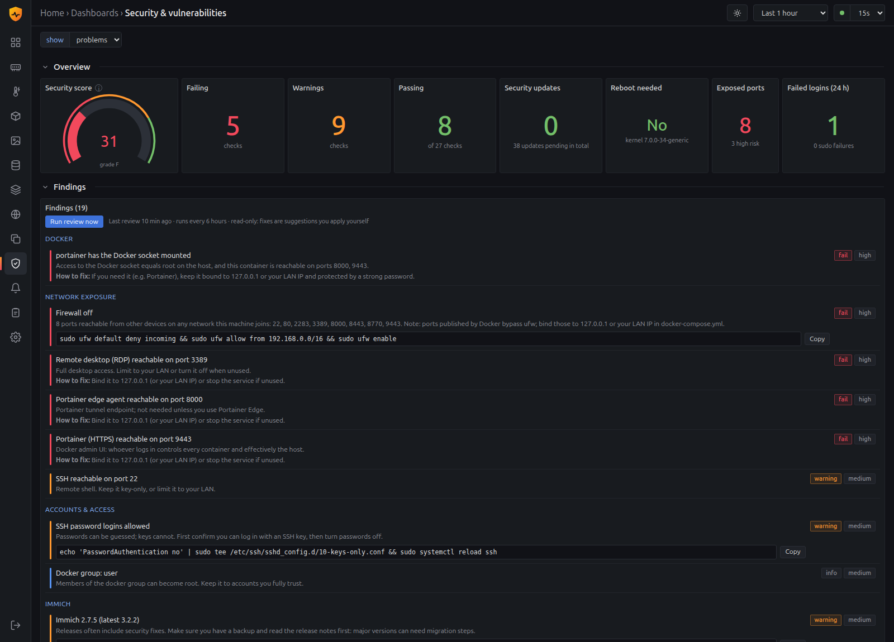 | 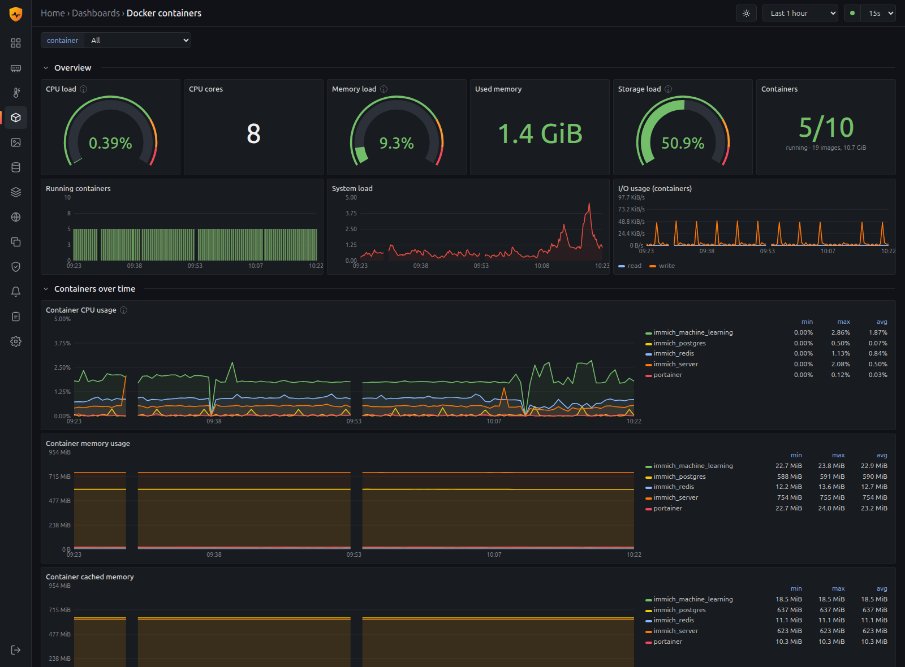 |
| **Immich** | **Storage & drive health** |
| 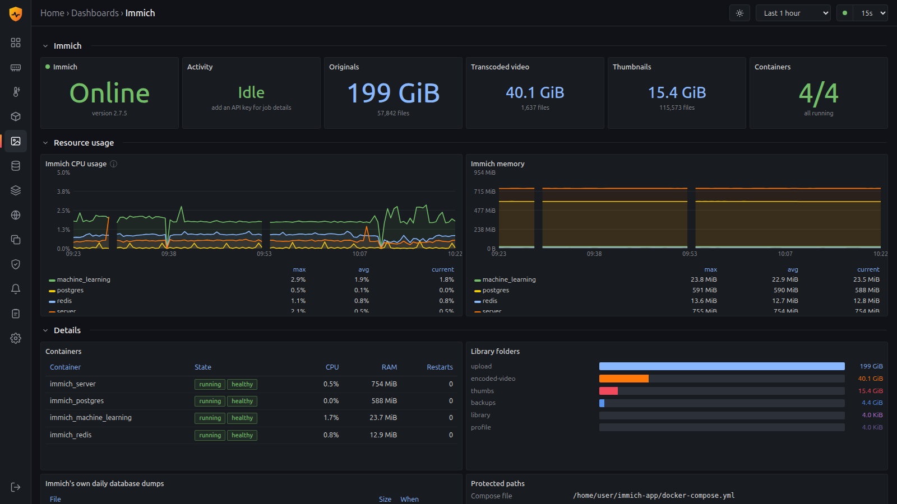 | 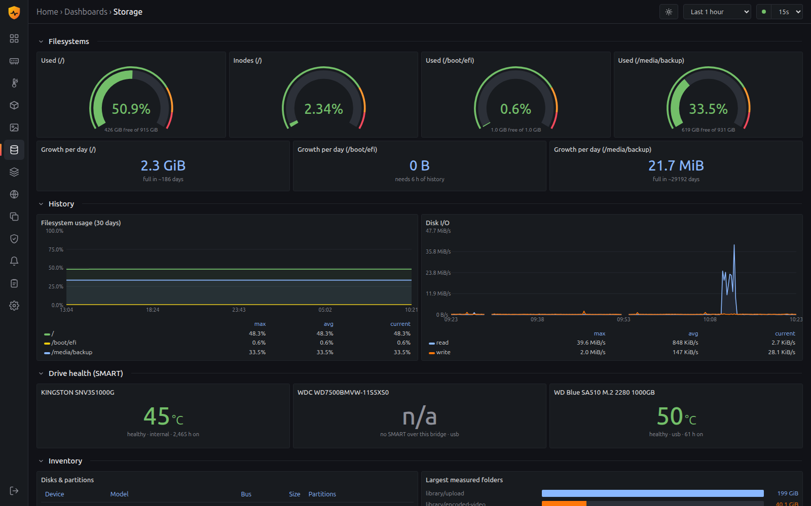 |
| **Services** | **Network** |
| 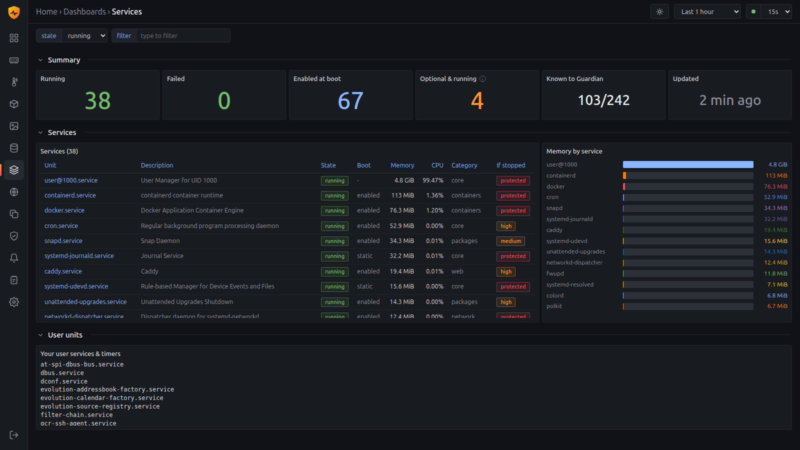 | 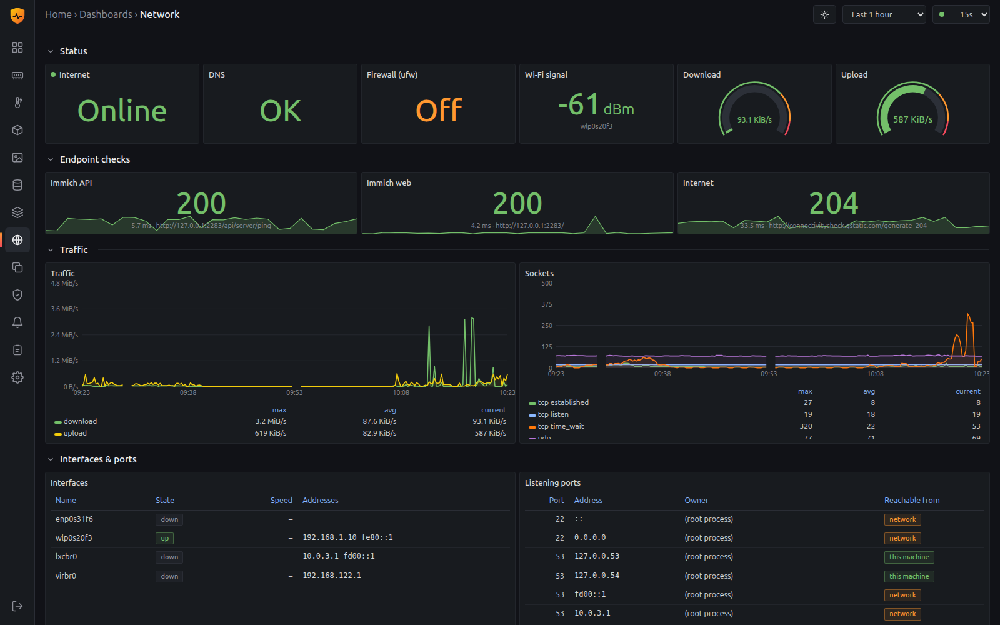 |
| **Recommendations** | **Duplicate files** |
| 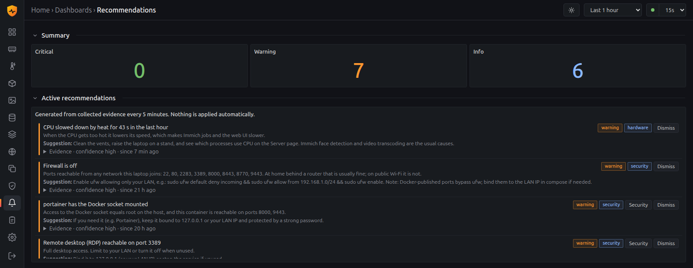 | 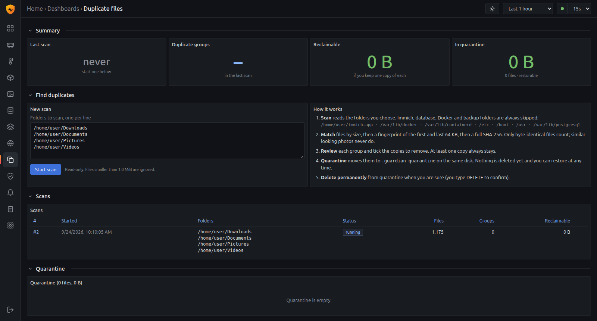 |
| **Audit log** | **Settings** |
| 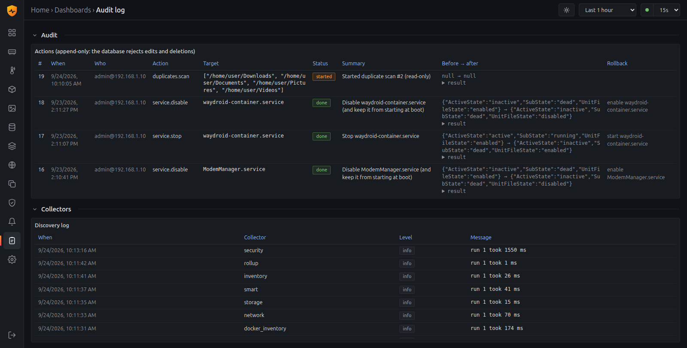 | 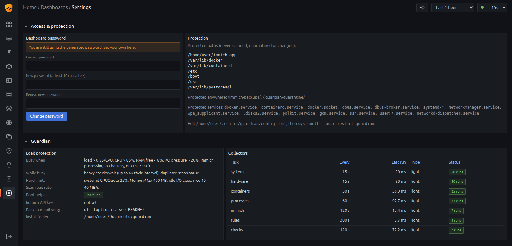 |
| **Phone layout** | |
| 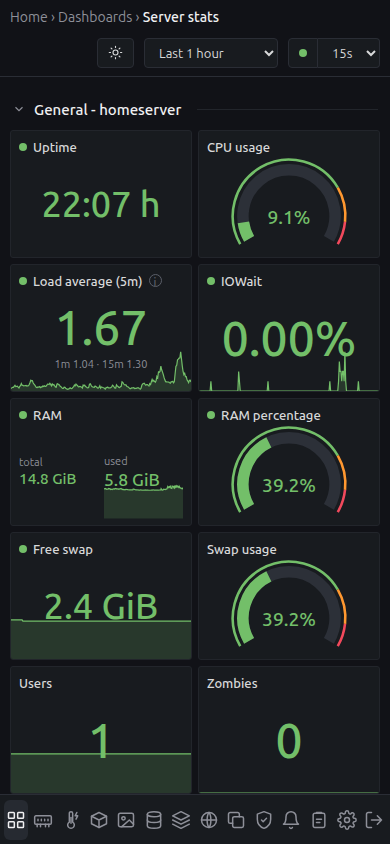 | |

## Requirements

- Ubuntu 24.04 or newer (other distributions with systemd 255+ and Python 3.11+ should work)
- Python 3.11+ (preinstalled on Ubuntu 24.04+)
- Docker with your user in the `docker` group (for container and Immich monitoring)
- Immich installed with Docker Compose (the default `~/immich-app` layout is detected automatically). Guardian also works without Immich as a general server monitor.

No pip, Node.js or database server needed. If `pip` is missing, the installer fetches the two Python packages through a throwaway `python` container, so nothing is installed system-wide.

## Install (step by step)

### 1. Get the code

```bash
git clone https://github.com/manojbarot1/ubuntu-guardian.git ~/ubuntu-guardian
cd ~/ubuntu-guardian
```

Guardian runs from wherever you clone it; keep the folder in place after installing.

### 2. Run the installer as your normal user (not with sudo)

```bash
./install.sh
```

It walks through five steps:

1. checks prerequisites
2. installs the Python dependencies into `./.vendor`
3. finds your Immich folder
4. installs the systemd user unit (with linger, so it runs while you are logged out)
5. starts Guardian and prints the address and your first password

```text
3/5  Locating Immich
  ✓ Immich found in /home/you/immich-app
...
Done.
  Dashboard:  http://192.168.1.10:8770   (home network only)
  Password:   Xy3...            (also in ~/.config/guardian/initial-password.txt)
```

If Immich lives elsewhere: `./install.sh --app-dir /srv/immich`.

### 3. Open the dashboard and change the password

Open the printed address from any device on your home network, log in with the password, then go to **Settings → Dashboard password** and set your own. (Forgot it? Run `bin/guardian-passwd` on the server.)

### 4. Review security

Open **Security**. The first review runs two minutes after start and then every six hours. Click **Scan images now** once to check your containers for known vulnerabilities; Guardian repeats that weekly afterwards.

### 5. Optional: enable service control

Guardian runs unprivileged. To start/stop/enable/disable **system** services from the dashboard, install the tiny root helper once:

```bash
sudo bash executor/install-executor.sh
```

It is a ~60-line script, installed root-owned in `/usr/local/lib/guardian`, socket-activated (zero processes when idle), and can only run `systemctl <start|stop|restart|enable|disable> -- <unit>` on units outside its own deny list. Remove it with `--remove`.

### 6. Optional: Immich job awareness

In Immich go to **Account settings → API keys → New API key** (admin account), then add it to `~/.config/guardian/config.toml`:

```toml
[immich]
api_key = "paste-key-here"
```

`systemctl --user restart guardian`. Guardian then knows when Immich is busy (thumbnails, face detection, video transcoding) and warns before actions during that time. Without a key it uses container CPU as a proxy.

## Dashboards

| Dashboard | What you see |
|---|---|
| **Server** | Uptime, CPU/RAM/swap gauges, load, IOWait, users, zombies, processes, threads, network connections, download/upload; disk and inode gauges; endpoint checks, Immich, drive temperatures; per-CPU charts; I/O and network charts; top processes |
| **Memory** | Live (2-second refresh, 1-second samples for the last hour): status line, used/available/cache/swap/pressure, RAM in/out, page faults, disk ↔ RAM; what the watcher noticed; stacked "what's in RAM" chart; in/out, paging, faults and PSI charts; programs and processes with growth and possible-leak tags |
| **Power & thermals** | Power source, battery charge and health gauges, power draw, cycles, charge limit; CPU temperature, hottest sensor, fan, throttling, CPU speed, power profile; history charts; daily battery-health trend; every sensor |
| **Docker** | CPU/memory/storage load, running containers over time, per-container CPU, memory, cache, network in/out and disk writes; containers table with start/stop/restart; images and volumes |
| **Immich** | Online/idle, originals/video/thumbnail sizes, container resource charts, Immich's own DB dumps, protected paths |
| **Storage** | Usage and inodes, growth per day, 30-day history, disk I/O, SMART, disks and partitions |
| **Services** | Running/failed/enabled counts, memory by service, filterable table; per-service page with explanation, dependencies, consequences, actions and rollback |
| **Network** | Internet/DNS/firewall/Wi-Fi, endpoint checks with latency, traffic and socket charts, interfaces, listening ports |
| **Duplicates** | Start scans with live progress, review groups (keep first / keep newest), quarantine / restore / delete permanently |
| **Security** | Score and findings with fixes, container CVEs, exposure, accounts and SSH, CPU vulnerabilities, kernel hardening, pending updates |
| **Recommendations** | All findings with evidence, suggestions and one-click actions |
| **Audit log** | Every action with before/after state and rollback, plus collector log |
| **Settings** | Password, protected paths and services, load limits, collector timings |

Pick the time range (15 min to 30 days) and auto-refresh (off to 5 min) at the top right. Click a legend entry to hide a series; click a row title to collapse it. The page stops polling when its tab is hidden.

## Security review

Everything runs **read-only and unprivileged**. Guardian only suggests fixes; it never applies them.

| Area | Checks |
|---|---|
| Patching | Pending security updates, automatic updates on, package lists fresh, reboot needed (flag file or newer kernel installed), fixes that need Ubuntu Pro |
| Network exposure | Firewall state, every port reachable from the network, rated by risk (remote desktop, Docker admin UIs, databases, SSH, …) |
| Accounts & access | Extra UID-0 accounts, docker group members (root-equivalent), SSH password and root login, failed logins in 24 h by source |
| Secrets & files | Immich `.env` (database password) permissions, `~/.ssh` permissions, Guardian's own config, generated password still in use |
| Docker | Privileged containers, Docker socket mounted (worse when also exposed), host networking |
| Kernel & hardware | CPU vulnerability mitigations, AppArmor, Secure Boot, 11 kernel hardening settings |
| Immich | Running version vs. latest release, plain-HTTP note |
| Containers (CVE) | [Trivy](https://trivy.dev) scan of every running image: critical/high/medium/low counts, fixable count, CVE list with installed and fixed versions |

The **score** starts at 100 and subtracts points for failing and warning checks, capped per category so one root cause (for example an exposed admin UI) doesn't zero it.

The image scan runs `aquasec/trivy` in a throwaway container with `--cpus 1 --memory 1g`, waits while the system is busy, and caches its database in the `guardian-trivy-cache` Docker volume. The first scan downloads ~250 MB of scanner image plus ~80 MB of vulnerability data. Set `image_scan_days = 0` under `[security]` to scan only when you click.

## How Guardian stays light

| Mechanism | Detail |
|---|---|
| Cheap sources | `/proc`, cgroup files and `/proc/net/tcp` instead of spawning tools; the 15-second collector takes ~4 ms |
| Load governor | Heavy work (services, SMART, Docker inventory, folder sizes, security review, image scans) waits while load > 0.85/CPU, CPU > 85%, RAM free < 8%, I/O pressure > 20%, or Immich is processing, the laptop is on battery, or the CPU is above 90 °C (up to 6× its interval, so data never goes stale) |
| Memory watch | Its own small thread, so heavy tasks never stall it: 3 small `/proc` reads per second (~0.2 ms); the per-process scan runs every 10 s, or early when memory moves by 64 MB; ~0.3% of one core in total. Top lists are built only when the Memory page asks |
| Duty cycle | The daily walk of the Immich library sleeps 9× as long as it works (~10% of one core) and never runs at startup |
| Throttled scans | Duplicate hashing reads at most 40 MB/s; Trivy is limited to 1 CPU and 1 GB |
| Hard limits | `CPUQuota=25%`, `MemoryMax=400M`, `Nice=10`, `IOSchedulingClass=idle` |
| Fast API | Metrics are pre-aggregated in SQLite and serialized directly; a dashboard refresh costs ~80 ms |
| Self-monitoring | Guardian measures its own CPU from its cgroup and raises a recommendation if it averages > 3% of a core |
| Retention | 15-second samples for 48 h, hourly roll-ups for a year, memory-watch 10-second averages for 7 days: the database stays small |

## Safety model

- **Read-only by default.** Discovery, metrics, security review and recommendations never change the system.
- **Protected paths:** the Immich folder, Docker and containerd data, `/etc`, `/boot`, `/usr`, database folders are never scanned, quarantined or touched.
- **Protected services:** Docker, networking, the desktop session, udisks, cron, SSH and core systemd units cannot be changed. The root helper enforces its own deny list independently.
- **Every change:** preview (impact, risk, current state, rollback) → confirmation (typing the name for risky ones) → preconditions re-checked at execution → append-only audit log (the database rejects edits and deletions of audit rows).
- **Confirmations** are HMAC-signed, expire after 5 minutes and are single-use.
- **Duplicates:** byte-identical only; at least one copy per group always stays; quarantine on the same disk; permanent deletion only from quarantine, after typing `DELETE`.
- **Containers:** start/stop/restart only. Nothing is ever pruned.
- **Web:** LAN-only IP allowlist, scrypt password hash, HttpOnly SameSite=Strict session, custom-header CSRF check, strict Content-Security-Policy, login rate limiting, no caching of API responses.
- **No AI with shell access.** Recommendations are deterministic rules over collected evidence.

## Configuration

| File | Purpose |
|---|---|
| `~/.config/guardian/config.toml` | Port, intervals, busy thresholds, retention, Immich folder and API key, protected paths/services, duplicate settings, endpoint checks, security review, backup monitoring. See [`config.example.toml`](config.example.toml) |
| `~/.config/guardian/auth.json` | Password hash (mode 600) |
| `~/.local/state/guardian/guardian.db` | Metrics, findings and the audit log (SQLite) |

Apply changes with `systemctl --user restart guardian`.

## Monitoring a backup job (optional)

Guardian does not back anything up itself, but it can watch the backup job you already have, if the job is a systemd `--user` unit, writes a small status file, or both:

```toml
[backup]
unit = "photo-backup"                 # shows the next run of photo-backup.timer, adds "Run backup now"
drive_uuid = "ABCD-1234"              # alerts when the drive is unplugged or filling up (lsblk -f)
status_file = "/home/you/.local/state/guardian/backup-status.json"
log_file = "/home/you/.local/state/guardian/backup.log"
max_age_days = 8
```

At the end of each run your job writes:

```json
{"result": "ok", "message": "backup complete", "finished": "2026-09-27T03:52:10+02:00", "target": "/media/you/Backup/photos"}
```

`result` is `ok`, `warning` or `failed`. Guardian then shows the last result, its age, the next run and the log, and raises recommendations when a backup fails, is older than `max_age_days`, or the drive is missing or nearly full. Without a `[backup]` section these panels stay hidden.

## Everyday commands

```bash
systemctl --user status guardian          # is it running?
systemctl --user stop guardian            # stop the dashboard and monitoring
systemctl --user start guardian           # start it again
systemctl --user restart guardian         # after editing config.toml
systemctl --user disable --now guardian   # stop and keep it off after reboots
journalctl --user -u guardian -n 50       # its log
bin/guardian-passwd                       # reset the dashboard password
./install.sh                              # update after git pull (keeps config and history)
```

## Troubleshooting

<details><summary><b>Can't log in</b></summary>

Use only the password (there is no username field). After 5 wrong attempts logins pause for 5 minutes. Reset from a terminal: `bin/guardian-passwd` (also clears the lockout).
</details>

<details><summary><b>Dashboard not reachable from my phone</b></summary>

Check `curl -I http://localhost:8770/login` on the server. If that works, a firewall is blocking port 8770: `sudo ufw allow from 192.168.1.0/24 to any port 8770`. Guardian only answers private network ranges; adjust `allowed_networks` in `config.toml` for other setups.
</details>

<details><summary><b>Service buttons say "Root helper installed ⛔"</b></summary>

Install it once: `sudo bash executor/install-executor.sh`.
</details>

<details><summary><b>Docker panels are empty</b></summary>

Your user needs Docker access: `sudo usermod -aG docker $USER`, log out and in, then `systemctl --user restart guardian`.
</details>

<details><summary><b>"Failed logins" says the journal is not readable</b></summary>

Add yourself to the `adm` group (default for the first Ubuntu user): `sudo usermod -aG adm $USER`, then log out and in.
</details>

<details><summary><b>The image scan fails</b></summary>

Check that Docker can pull images (`docker pull aquasec/trivy`), and look at the error shown on the image's card. Behind a proxy, configure Docker's proxy settings. Very large images may need more memory: set `trivy_memory = "2g"` under `[security]`.
</details>

<details><summary><b>A USB drive shows "no SMART data"</b></summary>

Some USB-SATA bridges don't pass SMART through. Nothing to fix. The drive's filesystem usage is still monitored.
</details>

## Uninstall

```bash
./uninstall.sh            # stop and remove the service (keeps config and history)
./uninstall.sh --purge    # also delete ~/.config/guardian and ~/.local/state/guardian
sudo bash executor/install-executor.sh --remove   # if you installed the root helper
docker volume rm guardian-trivy-cache             # if you ran image scans
```

## Development

```bash
./install.sh                                              # vendors dependencies into .vendor
PYTHONPATH=.vendor:. python3 -m unittest discover -s tests -v
systemctl --user restart guardian
```

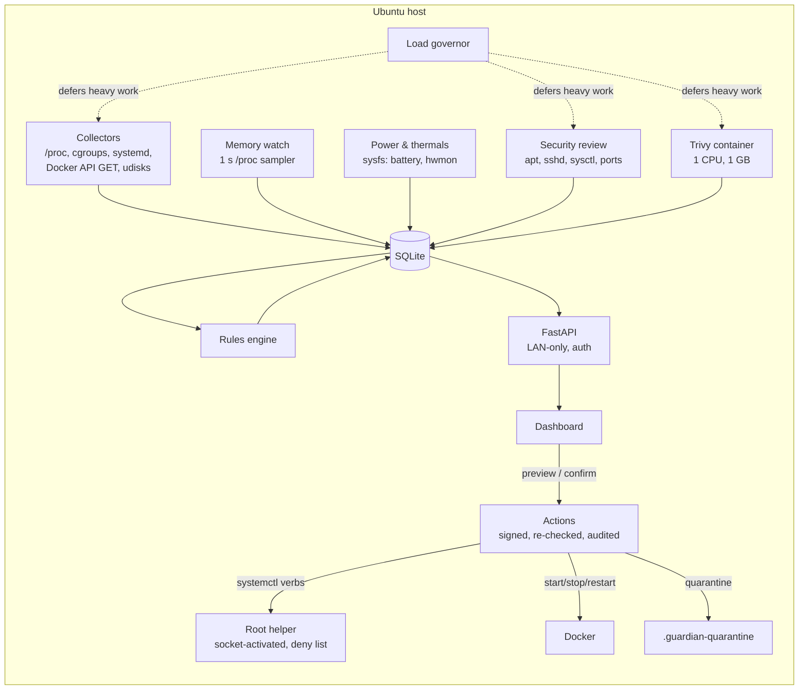

| Path | Role |
|---|---|
| `guardian/collectors.py` | Read-only discovery and metrics |
| `guardian/security.py` | Security review and Trivy image scans |
| `guardian/governor.py` | Busy detection, self-measurement |
| `guardian/memwatch.py` | Continuous memory watch (own thread) and its events |
| `guardian/hardware.py` | Battery, power, temperature, fan and throttling readers (sysfs) |
| `guardian/rules.py` | Recommendations |
| `guardian/intel.py`, `services_kb.py` | Service explanations |
| `guardian/actions.py` | Preview/confirm/execute/audit |
| `guardian/duplicates.py` | Duplicate scan and quarantine |
| `guardian/api.py`, `auth.py` | Web API and login |
| `guardian/static/` | Dashboard (vanilla JS, no build step) |
| `executor/` | Optional root helper |
| `systemd/` | Unit template (installed by `install.sh`) |
| `tests/` | Safety, memory-watch and hardware tests (run in CI) |

### Roadmap

- Optional local LLM (Ollama) explanations: read-only, no shell access
- Editing protected paths from the Settings page
- Notifications to a phone (ntfy / email)

## License

[MIT](LICENSE)
